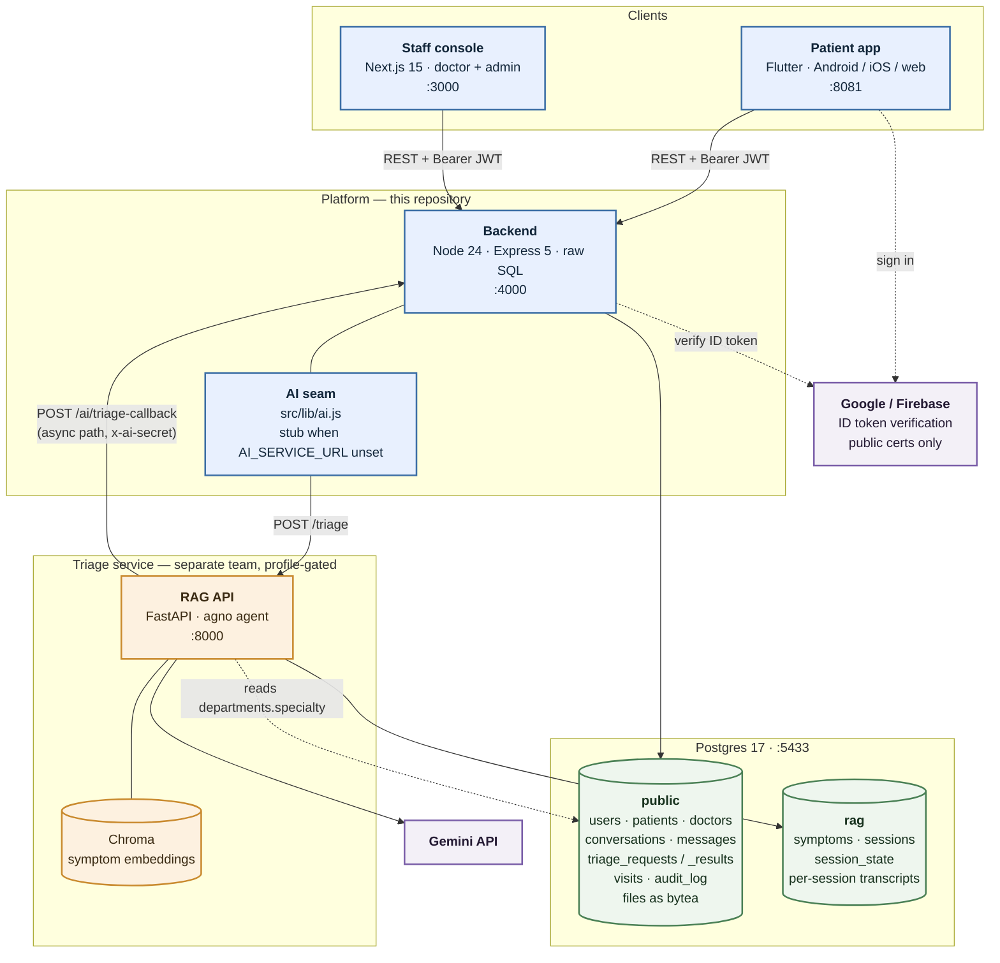
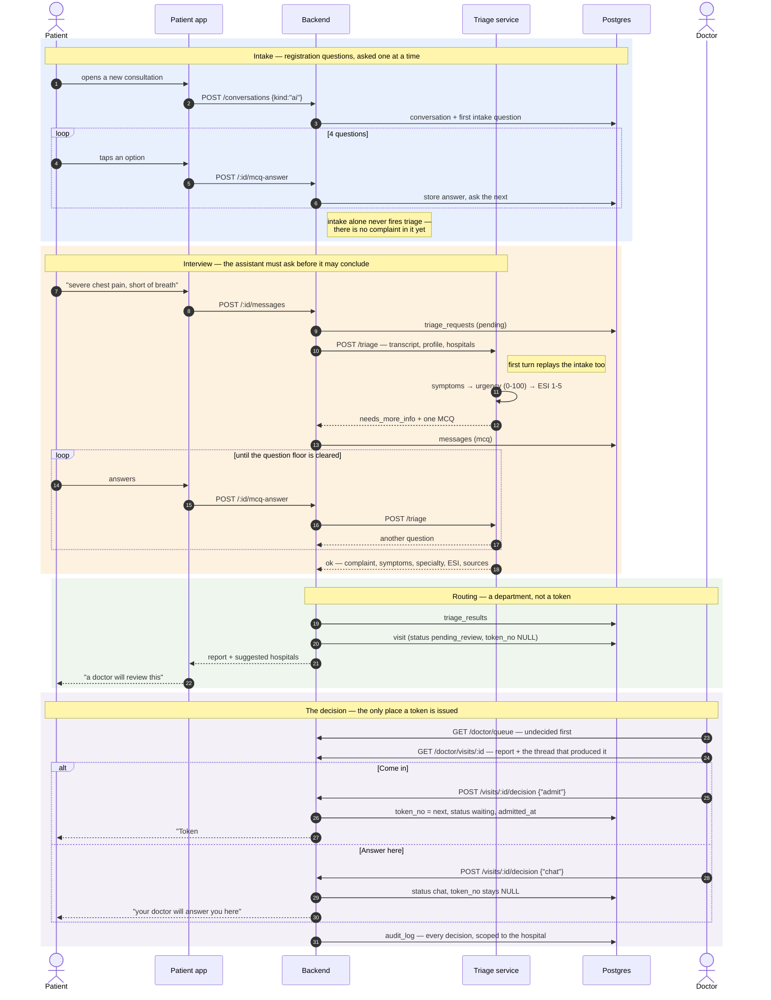
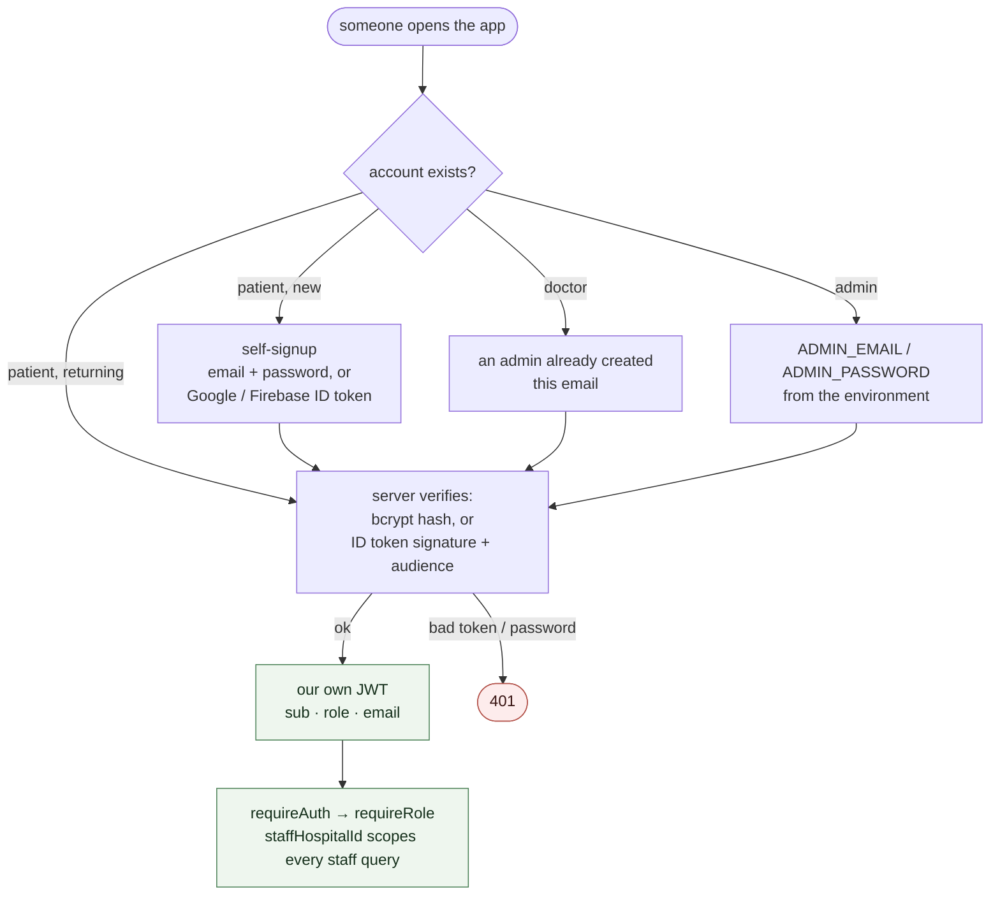
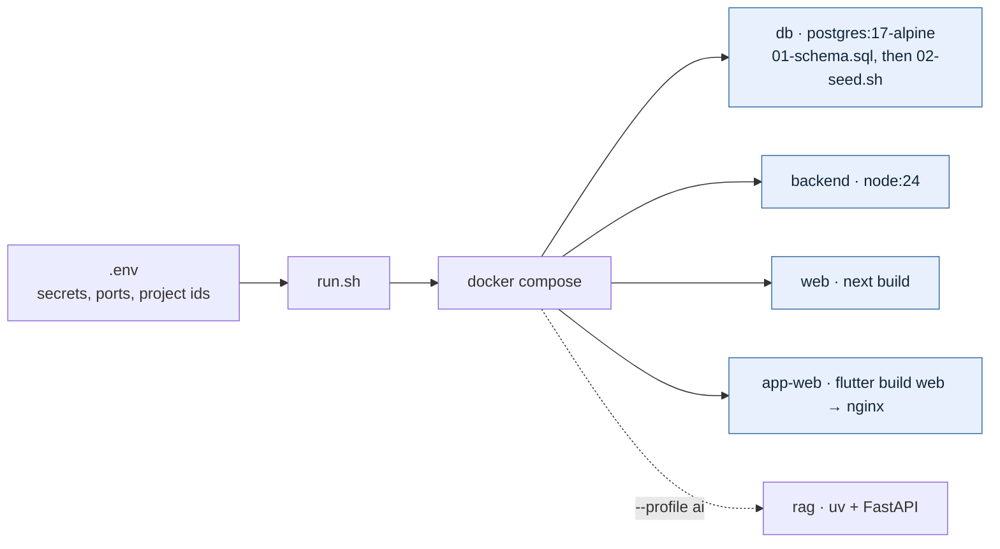

# Architecture

Sanjeevani AI — conversational hospital triage and registration.

Two diagrams: what the pieces are, and how a patient's problem moves through them.
Both are Mermaid and render on GitHub.

Related: [`SETUP.md`](SETUP.md) to run it, [`docs/AI-Integration-Contract.md`](docs/AI-Integration-Contract.md)
for the triage payload, [`db/01-schema.sql`](db/01-schema.sql) for the tables.

---

## 1. Architecture

Four services and one database. The AI service is profile-gated (`--profile ai`)
and reachable only through a single seam, so the platform runs and demos without it.

**Boundaries that matter**

| Boundary | Rule |
|---|---|
| AI seam | The backend never decides a specialty, an urgency or a red flag. It builds a payload, stores what comes back, and renders it. All reasoning is behind `POST /triage`. |
| Postgres schemas | The triage service shares the database but owns the `rag` schema. It reads `departments.specialty` and writes nothing to `public`. |
| Staff accounts | Never self-signup. An admin authorises the address; the first admin comes from `ADMIN_*` env. |
| Files | Stored as `bytea` in Postgres, served through `/files/:id` behind auth. No object store. |

---

## 2. Dataflow — one problem, end to end

The thing worth following is **where a token is issued**: triage routes a patient to
a department, but only a doctor deciding they should come in creates one. A consult
answered over chat never takes a queue slot.

### Where each thing is decided

```mermaid
graph LR
    subgraph rag["Triage service decides"]
        S1["which symptoms<br/>were described"]
        S2["urgency 0-100<br/>from the symptom table"]
        S3["recommended<br/>specialty"]
        S4["ask again, or<br/>conclude"]
    end
    subgraph be["Backend decides"]
        B1["which hospital<br/>nearest / preferred / suggested"]
        B2["which department<br/>specialty → departments"]
        B3["ESI → queue order"]
    end
    subgraph doc["The doctor decides"]
        D1["come in, or<br/>answer in chat"]
        D2["override the<br/>urgency"]
        D3["when the token<br/>is issued"]
    end

    rag --> be --> doc

    classDef a fill:#fdf1e0,stroke:#c98a2e,color:#3a2a12
    classDef b fill:#e8f0fe,stroke:#3b6ea5,color:#12263a
    classDef c fill:#f3f0f7,stroke:#7a5ea8,color:#241a33
    class S1,S2,S3,S4 a
    class B1,B2,B3 b
    class D1,D2,D3 c
```

Nothing clinical is decided in the middle column, and nothing final is decided in
the left one. That is the whole design: the model proposes, the database scores,
the doctor disposes — and every step lands in `audit_log`.

---

## 3. Authentication

An external ID token is only ever an assertion of identity. Roles come from our
`users` table, never from the token — and a Firebase or Google account is linked to
an existing user **only when the provider says the email is verified**, because an
unverified claim would otherwise hand someone the doctor account an admin created
for that address.

---

## 4. Deployment

`01-schema.sql` runs once on an empty volume. `02-seed.sh` loads demo data only
when `SEED_DEMO_DATA=true` — **off by default**, because every seeded account shares
one password published in this repository. A real deployment provisions its first
administrator from `ADMIN_*` instead, and that account is reconciled against the
environment on every boot.

The Flutter mobile build cannot be containerised; `app/Dockerfile` is the web build
served by nginx.
