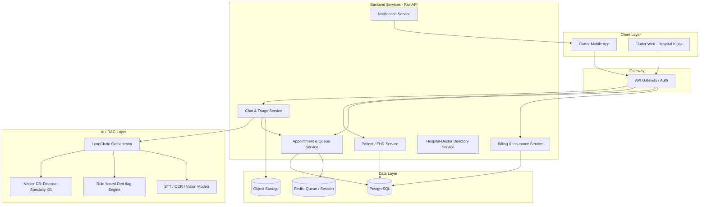
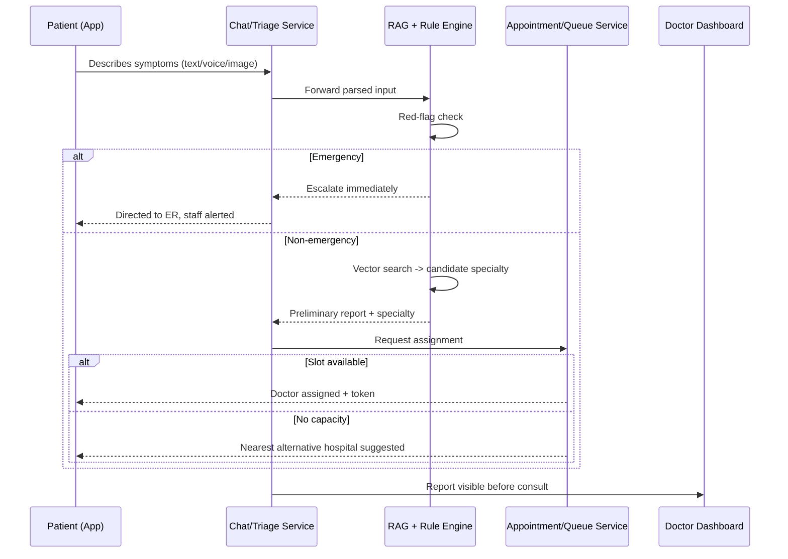
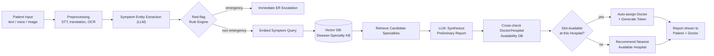

# Sanjeevani AI — Conversational Hospital Triage & Registration Platform
### Design Document — v0.1

---

## 0. Executive Summary

Sanjeevani AI is a mobile-first platform that lets a patient walk into (or approach) a hospital, describe their problem to an AI chat assistant in their own language, and come out the other side with: a completed registration, a preliminary clinical summary, a doctor/department assignment, a queue token, and — if needed — a redirect to a better-equipped nearby facility. The system is explicitly a **triage and routing layer**, not a diagnostic one: it decides *who a patient should see and how urgently*, and hands a doctor a clean starting point instead of a blank slate.

---

## 1. Problem Description

Outpatient departments (OPDs) in most Indian hospitals — government hospitals especially, but private ones too during peak hours — run on a workflow that hasn't changed much in decades:

- **Registration is manual and repetitive.** Patients fill the same paper/counter form on every visit, often standing in a separate line just to be *allowed into* the real line.
- **Patients don't know who to see.** There's no triage at the door. A patient with a skin issue and a patient with chest pain often join the same general queue, and self-routing to "the right doctor" is a guess made by someone with no medical training, sometimes literally by asking a stranger in line.
- **No urgency-based prioritization.** Because there's no structured intake, urgent cases don't get flagged until a doctor happens to see them — the queue is first-come-first-served regardless of severity.
- **Overcrowding is structural, not incidental.** A handful of well-known hospitals get flooded while nearby, equally capable facilities sit underused, simply because patients default to "the big hospital" out of habit or lack of information about alternatives.
- **Records don't travel with the patient.** History, past prescriptions, and reports are fragmented across paper files and hospital-specific systems, so every new visit — even at the same hospital — often starts from zero.
- **Billing and insurance are a separate ordeal.** Cashless claims, reimbursement paperwork, and bill tracking are handled through slow, mostly manual processes layered on top of an already slow visit.

The net effect: patients lose time and clarity, doctors lose time to administrative overhead and mis-routed cases, and hospitals lose the ability to allocate their own capacity intelligently.

---

## 2. Rationale

This section explains *why* the system is shaped the way it is — not just what it does.

**Why a conversational interface, not a form.**
Forms assume the patient already knows the right medical vocabulary and the right category to put themselves in. A chat interface (text or voice) lets someone describe "my stomach has been hurting since morning and I feel dizzy" in their own words, in their own language, and pushes the work of *structuring* that into the system rather than the patient.

**Why RAG instead of a general-purpose LLM answering freely.**
A model reasoning purely from its own parameters can hallucinate a specialty mapping or miss a red-flag combination of symptoms — unacceptable in a healthcare context. Grounding retrieval in a curated, vetted disease-to-specialty knowledge base means every routing decision can be traced back to a source, audited, and corrected, rather than trusted on faith. This is also the reason the system is scoped as **triage/routing, not diagnosis** — the AI's job is "which doctor, how urgently," never "what condition do you have." That boundary needs to be enforced in the architecture (see §5), not just stated as a disclaimer.

**Why a rule-based safety layer sits on top of the RAG output.**
Probabilistic retrieval is good at "which specialty is this closest to," but emergency detection (chest pain, breathing difficulty, stroke signs, severe bleeding) needs to be deterministic and impossible to argue with statistically. A fixed red-flag checklist that can override or bypass the RAG recommendation entirely is what makes the system safe to put in front of real patients.

**Why one profile across visits and hospitals.**
Re-entering the same history every visit is pure friction, and it's actively dangerous for people who can't communicate well in the moment (elderly patients, unconscious/semi-conscious emergency cases, non-native speakers). A persistent, portable profile — ideally interoperable with India's existing ABHA (Ayushman Bharat Health Account) digital health ID — removes that friction and gives emergency staff something to work from even if the patient can't speak.

**Why urgency-based prioritization, not just faster registration.**
Speeding up registration alone doesn't fix overcrowding — it just moves people through the same undifferentiated queue faster. The actual fix is letting the hospital *see* who's urgent before they reach the front desk, so triage happens at intake instead of by chance.

**Why a nearest-hospital recommender.**
A large share of "overcrowding" is really a load-balancing problem: too many people defaulting to one facility while a comparable one nearby is underused. Recommending an alternative — with the same preliminary report following the patient — turns a hard redirect into a soft one.

**Why billing/insurance is in scope at all.**
It's one of the most consistently frustrating parts of a hospital visit and it's a natural extension of "the AI already has your intake and appointment data" — claim initiation and bill tracking can piggyback on data the system is already collecting.

---

## 3. Planned Features

### Core (MVP)
- Conversational intake chatbot — text and voice, multilingual (Hindi + major regional languages + English)
- AI-generated preliminary report: chief complaint, symptom summary, suggested specialty, urgency score
- Deterministic red-flag/emergency detection that can escalate immediately, independent of the AI's own judgment
- Auto department/doctor assignment based on specialty match + real-time doctor availability
- Nearest-alternative-hospital recommendation when the current facility is unsuitable or overloaded or 
- One-time profile setup with a persistent patient ID (optional ABHA linkage) — registration on repeat visits takes seconds.
- Appointment booking for OPD + walk-in/emergency registration
- Portable medical history (EHR) that follows the patient across visits and, ideally, across hospitals in the network
- Billing & payments: view/pay bills, initiate and track insurance claims
- Doctor-side dashboard: see the AI-generated report before the consult, manage queue, override urgency if needed
- Hospital admin dashboard: patient flow analytics, department load, bottleneck visibility

### Multi-modal chat
- Text and voice input (speech-to-text)
- Image input — a visible symptom (rash, swelling, injury), or a photo of an existing prescription/report for OCR ingestion into history
- Structured output the patient can read and a doctor can scan in seconds

### Phase 2 / nice-to-have
- Insurance based recommendation of hospitals.
- Digital queue token with live queue status
- SMS/IVR fallback for patients without a smartphone or reliable data
- Proxy/family accounts for children, elderly, or dependents
- Integration with government schemes (Ayushman Bharat, CGHS, state health schemes)
- Pharmacy integration and e-prescriptions
- Post-visit follow-up chatbot and medication reminders
- Optional teleconsultation for cases that don't need a physical visit at all
- Feedback loop from doctors ("was this routing correct?") feeding back into RAG knowledge-base curation

---

## 4. High-Level Architecture

**Suggested stack:**

| Layer | Technology | Notes |
|---|---|---|
| Client | Flutter | Single codebase for Android/iOS; Flutter Web for hospital-side kiosks |
| Backend API | Python + FastAPI | Async-friendly, integrates cleanly with LangChain |
| AI orchestration | LangChain (+ LangGraph for multi-step flows) | Ties STT/OCR, retrieval, LLM, and the rule engine together |
| Vector DB | ChromaDB / Pinecone | Disease–specialty knowledge base + symptom embeddings |
| Relational DB | PostgreSQL | Patients, appointments, billing, doctor/hospital directory |
| Cache / real-time state | Redis | Queue state, session state, live token numbers |
| Object storage | S3 / GCS | Uploaded images, generated reports |
| Auth | JWT + OTP, optional Aadhaar/ABHA verification | |
| Deployment | Docker, Kubernetes | Standard CI/CD pipeline |

You've already built a FastAPI + ChromaDB RAG pipeline before (Pixly), so this stack isn't a cold start — the retrieval and service structure should feel familiar; the new ground here is mainly the safety/rule-engine layer and the multi-modal intake.

**System diagram:**

**Typical patient journey (sequence):**

---

## 5. RAG Pipeline Design

The pipeline is deliberately split into a **probabilistic retrieval path** (good for "which specialty fits best") and a **deterministic safety path** (good for "is this an emergency, yes or no") — they run in parallel, but the deterministic path can always override the probabilistic one.

**Stage breakdown:**

1. **Multi-modal preprocessing** — voice goes through speech-to-text (e.g. Whisper), images through OCR (for uploaded prescriptions/reports) or a vision model (for visible symptoms), and everything gets normalized/translated into a working language for downstream processing.
2. **Entity extraction** — an LLM pulls out structured fields: symptoms, duration, severity language, relevant history mentioned in the conversation.
3. **Red-flag rule engine (deterministic)** — a fixed, clinician-reviewed checklist (inspired by triage frameworks like the Emergency Severity Index) scans the extracted entities for known emergency combinations — chest pain + breathlessness, sudden severe headache, uncontrolled bleeding, etc. A match short-circuits straight to escalation, bypassing the RAG path entirely.
4. **Retrieval** — for non-emergency cases, the symptom description is embedded and matched against a curated vector store built from vetted medical taxonomies (e.g. ICD-10 categories mapped to specialties) — not scraped from the open web, so the knowledge base's provenance is controllable and auditable.
5. **Report synthesis** — an LLM turns the retrieved candidates + extracted entities into a short, structured preliminary report: chief complaint, likely specialty, non-diagnostic summary, urgency tier.
6. **Availability cross-check** — the suggested specialty is matched against real-time doctor/hospital availability. If the current hospital has capacity, the patient is auto-assigned; if not, the same report is used to recommend the nearest hospital that does.
7. **Output** — the same structured report is shown to the patient (plain language) and the doctor (clinical shorthand), so the doctor's first look at the patient isn't a blank slate.

---

## 6. Other Improvements & Roadmap

**Phasing:**
- **Phase 1 (MVP):** single-hospital pilot — chatbot triage, registration, queue token, doctor dashboard.
- **Phase 2:** multi-hospital network — nearest-hospital recommender, billing/insurance module.
- **Phase 3:** EHR interoperability (FHIR/HL7-aligned records), government scheme integration, teleconsultation option.
- **Phase 4:** predictive analytics — forecasting patient inflow by season/disease trend for hospital resource planning, ML-assisted doctor scheduling.

**Compliance & risk — worth designing around from day one, not bolting on later:**
- Patient health data falls squarely under India's DPDP Act, 2023 — consent flows and data-minimization need to be part of the design, not an afterthought.
- Because the tool influences (even if it doesn't make) clinical decisions, it likely falls under evolving CDSCO guidance on AI-based clinical decision support — worth tracking as the regulatory picture develops.
- A human-in-the-loop requirement should be non-negotiable: the doctor always confirms specialty/urgency; the AI's output is a suggestion with a visible confidence/rationale trail, never a final decision.
- Full audit logging of every AI recommendation (input, retrieved sources, output, and any doctor override) — both for safety review and for improving the knowledge base over time.
- Accessibility: elderly, low-literacy, and differently-abled users need a voice-first path that doesn't assume typing or reading comfort.
- Bias/fairness testing across languages and dialects — a triage system that works well in English/Hindi but degrades in other regional languages recreates the exact inequity it's meant to fix.

---

*This is a first-pass design document — architecture and stack choices are meant as a strong starting point, not a locked spec. The rule-engine/RAG split in §5 is probably the single most important piece to get right before building anything else, since it's what makes the system safe to test on real patients.*