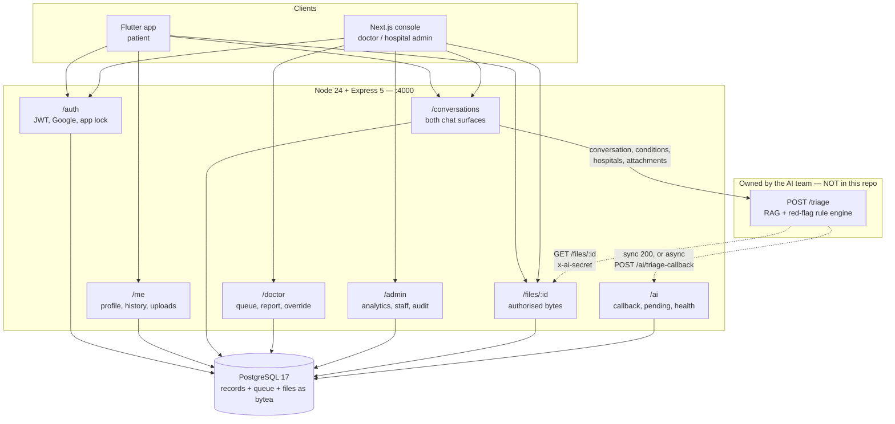
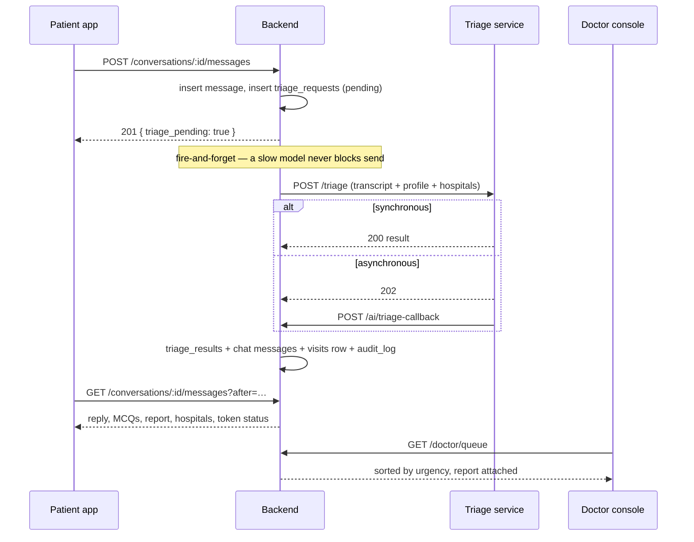

# Architecture

## Layers

Three processes and one database. No message broker, no cache, no object store — see
[Home](Home) for why each was dropped.

---

## The triage round trip

**Why polling.** The app polls every 3 seconds while a chat is open; the dashboards
poll every 8–30 seconds. No WebSockets, no push service, no Redis pub/sub. At OPD
scale — tens of concurrent conversations per hospital — that is a handful of indexed
queries per second. `GET /conversations/:id/messages?after=<iso>` returns only what is
new, so a poll is cheap. Swap in SSE if it ever shows up in battery or DB numbers;
the endpoint shape does not have to change. Marked in
`backend/src/routes/chat.js`.

**Why fire-and-forget.** `POST /messages` returns as soon as the patient's message is
stored. Triage runs after the response. A model that takes 20 seconds costs the patient
a spinner, not a failed send, and a model that dies leaves a `status` message in the
transcript instead of silence.

---

## Where each responsibility lives

| Concern | File | Note |
|---|---|---|
| Request validation | `backend/src/lib/http.js` | `str/num/bool/enumOf/uuid/email` throw `HttpError`; the error handler turns those into JSON. Enum helpers mirror the SQL `CHECK` constraints. |
| DB access | `backend/src/lib/db.js` | `query/one/many/tx`. Raw parameterised SQL, no ORM, no query builder. |
| Auth | `backend/src/lib/auth.js` | JWT sign/verify, bcrypt, Google ID-token verification, `requireAuth`, `requireRole`, `staffHospitalId`. |
| Uploads | `backend/src/lib/upload.js` | Multer memory storage → `files.data` bytea. Size cap + mime allowlist. |
| AI seam | `backend/src/lib/ai.js` | Outbound call, response normalisation, offline stub. **The only file that talks to the AI service.** |
| Triage orchestration | `backend/src/lib/triage.js` | Builds the payload, persists results, emits chat messages, creates the queue entry, picks the hospital. |
| Audit | `backend/src/lib/audit.js` | Append-only. Never fails a request. |

Routes are thin: validate, one or two SQL statements, respond. Business logic that two
routes share moves into `lib/`; nothing else does.

---

## Access control

Every mutating route goes through `requireAuth`, and `requireRole` where a role matters.
Beyond that, three rules do the real work:

1. **Patients only see their own rows.** Every `/me/*` query is keyed on
   `req.user.id`; deletes use `where id = $1 and patient_id = $2` so a wrong id is a
   404, not someone else's record.
2. **Staff are scoped to one hospital.** `staffHospitalId(user)` resolves the caller's
   hospital from `doctors` or `hospital_admins`, and every staff query filters on it.
   A doctor at hospital A cannot read a visit, a file, or a thread at hospital B.
3. **Staff reach a patient only through a visit.** Reading a patient's file or their
   assistant transcript requires a `visits` row linking that patient to the staff
   member's hospital. Doctors can *read* an assistant thread (that is the point — the
   report before the consult) but `can_post` is false, so they cannot inject messages
   into the patient's conversation with the assistant.

The AI service authenticates with a shared secret (`x-ai-secret`, compared with
`timingSafeEqual`), not a user JWT — it is a service, not a person.

`scripts/smoke.sh` asserts each of these boundaries.

---

## Files in Postgres

Images and scanned PDFs go into `files.data` as `bytea`, with the owning user, mime,
and size alongside. There is no object store in this deployment.

Consequences worth knowing:

- `GET /files/:id` streams bytes behind the auth rules above. Because it needs a header,
  a plain `` would 401 — both clients fetch the bytes and wrap them
  (`web/app/ui.tsx` → `AuthFile`, `app/lib/widgets/authed_image.dart` → `AuthedImage`).
- 10 MB per file, mime allowlist. `bytea` is comfortable at that size; it would not be
  for DICOM studies. The upgrade path (large objects, or an object store) is marked in
  `db/01-schema.sql`.
- Backups are simple: the database *is* the whole system state.

---

## Deliberate shortcuts

Marked with `ponytail:` comments in the source, harvestable with a grep:

| Shortcut | Where | Upgrade when |
|---|---|---|
| Token numbers via `max()+1` | `backend/src/lib/triage.js` | Two intake points register at the same instant. Use a per-hospital sequence or an advisory lock. |
| `bytea` for all binaries | `db/01-schema.sql` | Files get large. Large objects or an object store. |
| Polling instead of push | `backend/src/routes/chat.js` | Battery or DB load shows it. SSE. |
| Gallery-only attachments | `app/lib/pick_file.dart` | Someone needs to photograph a report in-app. Add `image_picker`. |
| No migration tool | `db/` | The schema changes while real data exists. |

---

## What is deliberately absent

- **Any clinical logic.** No symptom rules, no severity heuristics, no red-flag
  checklist. The backend stores and displays what the AI layer decides.
  See [AI Integration Contract](AI-Integration-Contract).
- **Billing.** `GET /me/bills` returns the visit ledger and `billing_enabled: false`.
  Phase 2 in `Design docs/Design_doc.md` §6.
- **Real Aadhaar verification.** `POST /me/aadhaar/verify` is a UI-only mock, exactly as
  `Design docs/App_Feature_Set.md` specifies. See [Security and Compliance](Security-and-Compliance).
- **Notifications.** `patient_relatives.notify` is stored and shown to the doctor, but
  nothing sends an SMS. No provider is wired.
- **Speech-to-text.** The mic button is a stub. The attachment endpoint already accepts
  `audio/*`, so wiring STT needs no client API change.
