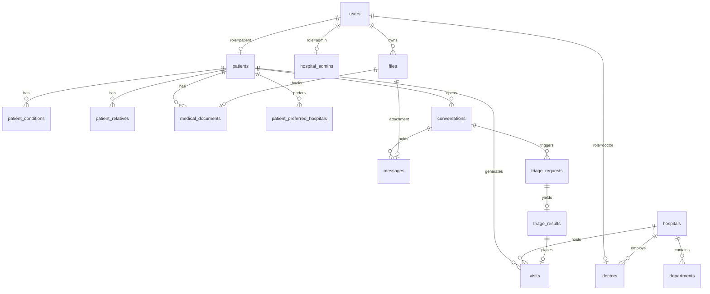

# Data Model

PostgreSQL 17. Source of truth: `db/01-schema.sql`, demo data in `db/02-seed.sql`.
Both run once, on the container's first boot.

Conventions:

- `uuid` primary keys, `gen_random_uuid()` default (pgcrypto).
- Enums are `text` with `CHECK` constraints, not Postgres `ENUM` types — adding a value
  is a one-line change instead of an `ALTER TYPE` dance. The API's `enumOf()` helper
  mirrors each list.
- `timestamptz` everywhere, `now()` defaults.
- Cascades point at the owner: deleting a user deletes their patient row, files,
  conditions, relatives, documents, conversations, and visits.
- **Age is never stored.** Derived from `patients.dob` by `ageFrom()` on every read.

---

## Overview



---

## Identity

### `users`
One row per human, whatever their role.

| Column | Notes |
|---|---|
| `email` | Unique, always stored lowercased by the API. |
| `password_hash` | Nullable — Google-only accounts have none. bcrypt, cost 10. |
| `google_sub` | Unique, nullable. The Google `sub` claim. Set on first Google sign-in, including when linking an existing password account. |
| `role` | `patient` \| `doctor` \| `admin`. |
| `is_active` | An admin can disable an account without deleting it; `requireAuth` rejects inactive users. |

### `files`
Binary content. There is no object store in this deployment.

| Column | Notes |
|---|---|
| `owner_user_id` | Who uploaded it. Access checks start here. |
| `mime`, `size_bytes` | Set from the validated upload, not from client claims. |
| `data` | `bytea`. 10 MB cap enforced in `upload.js`. |

---

## Patients

### `patients`
One-to-one with a `users` row. Everything `Design docs/App_Feature_Set.md` §1.2 lists.

| Column | Notes |
|---|---|
| `dob` | Age is derived from this, never stored. |
| `gender` | `male` \| `female` \| `other` \| `prefer_not_to_say`. |
| `lat`, `lng` | Optional. Only used to sort hospitals by distance. |
| `aadhaar_last4`, `aadhaar_verified` | **Mock.** Set by a UI-only flow; nothing is verified against UIDAI. Only four digits are kept. |
| `app_lock_pin_hash` | bcrypt of the app PIN. Never leaves the server — the API returns a boolean `app_lock_set` instead. |
| `language` | Passed to the AI layer with each triage request. |
| `profile_complete` | The app's gate: false → the setup screen, true → the home shell. |

### `patient_conditions`
Multi-input list. `kind` is `disease` \| `allergy` \| `genetic`, plus a free-text
`label` and optional `notes`. Sent with every triage request and shown on the doctor's
screen.

### `patient_relatives`
Who to inform if the patient is admitted. `name`, `contact`, `relation`, and `notify`.
Stored and displayed; **no SMS is sent** — no provider is wired.

### `patient_preferred_hospitals`
Join table. Used as the second choice when placing a queue token, after whatever the
AI suggested.

### `medical_documents`
The patient's own words for what a file is (`label` — "blood test", "x-ray") plus
optional `description`, pointing at a `files` row. Deleting the document deletes the
file.

---

## Facilities

### `hospitals`
`name`, `address`, `city`, `phone`, `lat`, `lng`. Coordinates drive the distance sort
and the nearest-alternative suggestion.

### `departments`
| Column | Notes |
|---|---|
| `name` | Display text. |
| `specialty` | **The routing key** the AI layer returns. Lowercase underscore slug, unique per hospital. `ENT / Otolaryngology` → `ent_otolaryngology`. |

Seeded keys: `general_medicine`, `cardiology`, `orthopaedics`, `dermatology`,
`emergency`, `paediatrics`.

### `doctors` / `hospital_admins`
Extend a `users` row with the hospital, department, specialty, registration number, and
an `is_available` duty flag. `staffHospitalId()` reads these to scope every staff query.

---

## Chat

### `conversations`
| Column | Notes |
|---|---|
| `kind` | `ai` (triage assistant) or `care_team` (real hospital staff). The patient must always know which they are in, so the app renders them as separate tabs. |
| `hospital_id` | Required for `care_team`, null for `ai`. |
| `last_message_at` | Sort key for both inboxes. |

### `messages`
| Column | Notes |
|---|---|
| `sender_role` | `patient` \| `ai` \| `doctor` \| `system`. |
| `kind` | `text`, `image`, `audio`, `mcq`, `mcq_answer`, `hospital_suggestion`, `report`, `status`. |
| `body` | Display text for every kind — a client that does not understand a kind still shows something readable. |
| `payload` | `jsonb`: MCQ questions, the chosen answers, the report fields, the hospital list, the token/status detail. |
| `file_id` | Attachment, exposed to clients as `file_url`. |

One `mcq` message holds **all** the questions from a triage round; the patient's reply
is a single `mcq_answer` message with `payload.answers` keyed by question id. Keeping
both in the transcript is what lets the AI layer read back the full context on the next
round.

---

## Triage seam

Owned by the AI team. This backend writes requests and reads results; it never computes
a specialty, urgency, or red flag. See [AI Integration Contract](AI-Integration-Contract).

### `triage_requests`
| Column | Notes |
|---|---|
| `status` | `pending` \| `done` \| `failed`. |
| `source` | `stub` \| `http` \| `callback` — which path produced the answer. |
| `request` | The exact payload sent, `jsonb`. Reproducible after the fact. |
| `error` | Failure reason; the patient sees a `status` message in the chat. |

### `triage_results`
One per request (`triage_request_id` is unique, so replaying a callback is a no-op).

| Column | Notes |
|---|---|
| `chief_complaint`, `symptoms` | Headline and structured symptom list. |
| `specialty` | Matched against `departments.specialty`. |
| `urgency` | 1–5, 1 most urgent. Clamped on ingest. |
| `red_flag` | Only literal `true` counts. Forces urgency 1 and routes to `emergency`. |
| `summary` | Patient-facing, plain language. |
| `clinical_note` | Doctor-facing shorthand. Never shown to the patient. |
| `sources` | Provenance for the routing decision. |
| `suggested_hospitals`, `follow_up_questions` | `jsonb`, rendered as cards and MCQs. |
| `confidence` | Shown as a percentage next to the suggestion. |
| `raw` | The untouched provider response, for audit and for replaying a decision later. |

---

## Queue

### `visits`
One row per registration — this *is* the queue token.

| Column | Notes |
|---|---|
| `token_date` + `token_no` | Unique per hospital per day. Generated with `max()+1`; racy under simultaneous intake, flagged in the source. |
| `urgency` | Copied from the triage result, or 4 by default. The queue sorts on it. |
| `urgency_overridden` | Set automatically when a doctor changes it, so the dashboards can mark human judgement (✎) distinctly from the AI's suggestion. |
| `status` | `waiting` \| `in_consult` \| `done` \| `referred` \| `cancelled`. |
| `triage_result_id` | Links the token back to the report and its provenance. |
| `doctor_notes` | Free text from the consult. |

Queue ordering: `in_consult` first, then `urgency` ascending, then `created_at` — most
urgent first, longest waiting next. That is the specific thing `Design docs/Design_doc.md` §1 says
today's first-come-first-served OPD queues get wrong.

### `audit_log`
Append-only. `Design docs/Design_doc.md` §6 requires every AI recommendation and every doctor
override be recoverable later.

Actions written today: `auth.register`, `auth.login`, `patient.profile_updated`,
`patient.aadhaar_mock_verified`, `chat.mcq_answered`, `triage.result_applied`,
`triage.failed`, `visit.updated`, `admin.department_created`, `admin.doctor_created`,
`admin.doctor_updated`.

`visit.updated` records both the AI's urgency and the doctor's, so a disagreement is
visible without diffing rows. Logging failures are swallowed — an audit write never
fails the request it describes.

---

## Changing the schema

There is no migration tool. `db/*.sql` runs only against an empty data directory.

```bash
docker compose down -v && docker compose up -d db
```

That destroys all local data. Add a migration tool before there is data anyone minds
losing.
